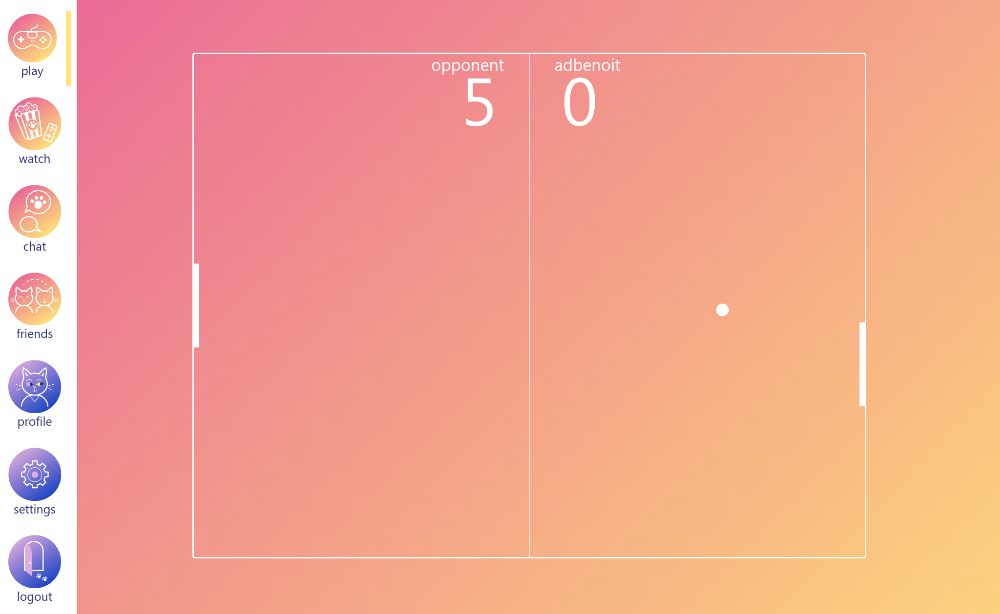

# FT_TRANSCENDANCE (@42Paris)
*Soon, you will realize that you already know things that you thought you didn’t*

## About
This project is about creating a website for the mighty Pong contest. Users can play Pong with others and communicate through a chat interface.
- backend : written in NestJS
- frontend : written in VueJS
- database : PostgresSQL

The website is available at localhost:4200

## Launch
```
$ git clone https://github.com/adbenoit-9/42_ft_transcendance.git
$ cd 42_ft_transcendance
$ docker-compose up --build
```

## Preview



*In collaboration with [abenoit][1], [gmaris][2] and [thsembel][3] 🔥*

[1]: https://github.com/42-abenoit
[2]: https://github.com/gmaris42
[3]: https://github.com/Gropopus
